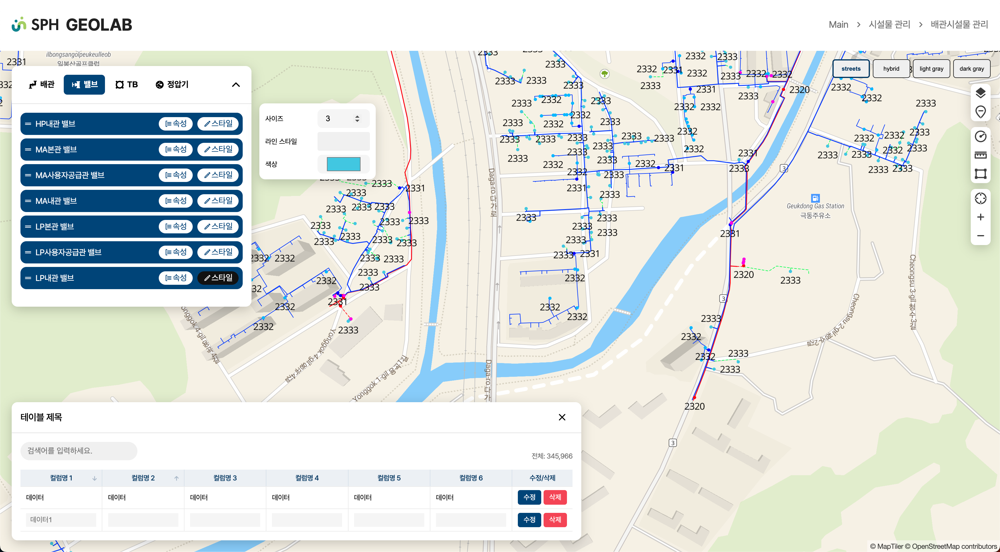

# geolab-app
Open source GIS 기술을 활용한 다양한 기술 예제를 구현 하기 위한 Front-end 프로젝트



# 개발 환경
`React v18`
`styled-components v6`
`SCSS`
`zustand v4`
`typescript v5`
`vite v5`

# 설치 및 빌드
## package 설치
```
yarn install
```

## 개발 모드 
```
yarn dev
```

## App 빌드
```
yarn build
```