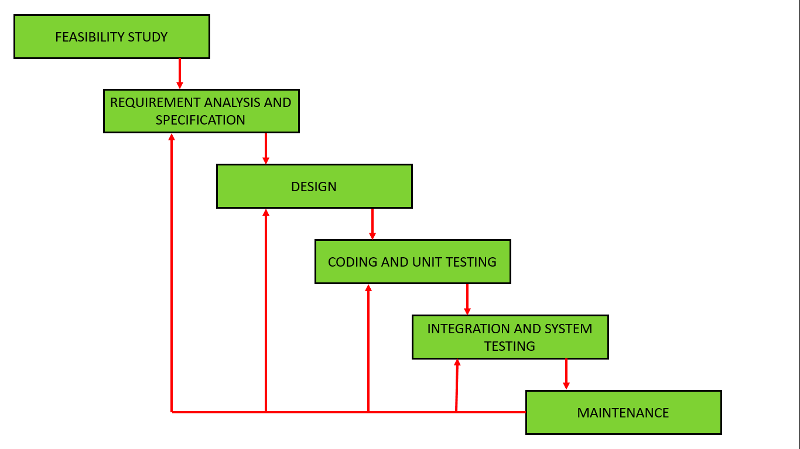

# 개발 방법론
Geolab Front-end 개발 참여 절차
- Iterative Waterfall Model

# 개발 절차
## 기능 목록(사용자 요구사항) 정의
* `개발자`가 기능 목록을 정의 하고 `기획자`와 `디자이너`에게 공유
  * https://docs.google.com/spreadsheets/d/1Lgr9fj3J7OGqEZnKyZMGses513Mg1RcZ46R3lYfN7to/edit#gid=0
* 필요한 경우 `개발자`는 기술적 검토를 위해 feasibility 테스트 진행
* 사용자 요구 사항 정의 시 `개발자, 기획자, 디자이너` 모두 반드시 해당 분야 도메인 지식 스터디 할 것
  * Geolab의 목적은 SPH 프로젝트 수주, 성공 적인 수행을 위한 것
  * 업무 시스템을 이해 하고 기존 문제 도출, 해결 방안 제시 하는 것이 목적

## 디자인
* 정의된 기능 목록을 기반 으로 화면에 구현될 기능 범위와 주요 제약 사항 정의 (`기획자, 개발자`)
* `디자이너`는 결정된 기획 기반 Wireframe, UI 구현
  * `개발자`는 반드시 완성된 UI를 기반으로 코딩을 시작한다.
  * `디자이너`가 직접 UI를 구현 하는 경우 `개발자`가 개발을 시작 하기 전에 반드시 완성해야 한다.
* UX와 UI 디자인 완성 된 후 `디자이너` 중심 으로 `기획자, 개발자`가 최종 검토 후 완성 한다.
  * Figma상 완성된 UX/UI 디자인이 최종 화면 설계서
  * DB 설계자는 화면 설계서를 기반으로 DB를 설계

## 개발 & 테스트
* 완성된 화면 설계서를 기반 으로 코딩을 시작 한다.
* 프론트엔드 개발은 반드시 사용자 인터렉션을 포함한 UI를 먼저 개발 하고 기능을 구현
  * `디자이너`가 직접 UI를 구현 하는 경우 `개발자`가 개발을 시작 하기 전에 반드시 UI가 완성된 상태에서 시작
* 가능한 경우 테스트 코드를 작성 하고 최소한 unit 테스트  

## 코드 리뷰
* 개발이 완료 되면 `pull request`를 생성 하고 동료들에게 코드 리뷰
